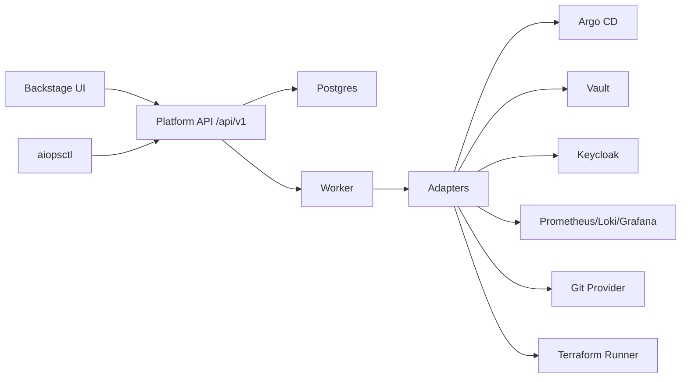

# AIOps Platform

A modular, config-driven DevOps platform for multi-tenant operations with **cluster-per-tenant** as the default model.

It provides a unified control plane built around:
- **Backstage** as the primary user experience
- **Platform API (`/api/v1`)** as the single backend contract
- **`aiopsctl` CLI** as an API-first automation client

## What You Get
- Tenant onboarding for `BYOC` and `PROVISIONED` modes
- GitOps orchestration per tenant (Argo CD adapter)
- Tenant-scoped secrets (Vault adapter)
- Tenant-scoped observability workflows (Prometheus/Loki/Grafana integration model)
- Incident evidence pipeline + investigator + PR-only remediation loop
- Policy-gated operations, approvals, audit trails, and compliance exports
- Drift detection, runbooks, metering/FinOps foundations, and platform ops endpoints

## Core Design Principles
- No hardcoded infrastructure assumptions
- All behavior is externalized to configuration
- Vendor/tool specifics live in adapters/plugins, not core logic
- Security enforcement is server-side (API/worker), not UI-only
- AI actions remain safe by design: **proposal + PR only**, no direct prod mutation

## High-Level Architecture


## Repository Layout
- `services/platform-api/`: FastAPI service, workers, adapters, policies, storage, tests
- `services/aiopsctl/`: unified CLI
- `ui/backstage/`: Backstage app and plugin pages
- `platform/gitops/`: management-plane GitOps manifests/charts
- `config/`: platform/module/provider/product/policy config examples
- `schemas/`: JSON schemas for config and AI artifacts
- `db/`: SQL schema
- `docs/`: architecture and operator/developer documentation
- `sdk/`: generated Python and TypeScript clients
- `dev/`: local install/verify/demo/reset scripts

## Beta Quickstart
Prerequisites:
- Docker / Docker Compose
- Python 3.11+
- `uv`
- Node.js (for Backstage development)

From repository root:
```bash
make beta-install
make beta-verify
make beta-demo
```

Then open:
- Backstage: `http://localhost:3000`
- Platform API docs: `http://localhost:18000/docs`

## Kubernetes Quickstart (Local Cluster)
```bash
docker build -f services/platform-api/Dockerfile -t local/aiops-platform-api:dev .
docker build -f ui/backstage/Dockerfile -t local/aiops-backstage:dev .
kubectl apply -f k8s/local/stack.yaml
kubectl apply -f k8s/local/observability-vault.yaml
helm repo add harbor https://helm.goharbor.io
helm repo update
helm upgrade --install harbor harbor/harbor -n registry -f k8s/local/harbor-values.yaml
```

Access:
- Backstage: `http://localhost:30080`
- API: `http://localhost:30081`
- Keycloak: `http://localhost:30082`
- Argo CD: `http://localhost:30083`
- Harbor: `http://localhost:30084`

## Local Development
Platform API:
```bash
cd services/platform-api
uv sync
uv run uvicorn src.main:app --reload --port 18000
```

Backstage:
```bash
cd ui/backstage
npm install
npm start
```

Optional demo reset:
```bash
./dev/beta-reset.sh
```

## Key Workflows Supported in UI/CLI
- Tenant onboarding and lifecycle tracking
- Product marketplace enable/disable with policy gates
- Service scaffolding and promotion workflows
- Deployment status, sync, rollback actions
- Incident timeline: evidence -> investigate -> create PR -> close
- Drift dashboards and manual drift runs
- Access requests and approvals
- Export bundle generation and download
- Metering views and collection triggers

## API, CLI, and SDK
- Stable API: `/api/v1`
- CLI: `services/aiopsctl/src/aiopsctl.py`
- SDKs:
  - `sdk/python/`
  - `sdk/typescript/`

## Security and Governance
- Keycloak-backed identity adapter support
- Configurable RBAC + policy engine enforcement hooks
- Correlation-aware audit trails and policy decision persistence
- Vault-backed secret reference patterns (no secrets in Postgres)
- Tenant scoping enforced for observability and high-risk operations

## Documentation Index
- Beta docs index: `docs/beta/README.md`
- Quickstart: `docs/beta/quickstart.md`
- Operator guide: `docs/beta/operator-guide.md`
- Tenant admin guide: `docs/beta/tenant-admin-guide.md`
- Developer guide: `docs/beta/developer-guide.md`
- Security/governance guide: `docs/beta/security-governance.md`
- Known limitations: `docs/beta/known-limitations.md`
- Release scope: `BETA_RELEASE.md`

## Notes on Extensibility
This platform is intentionally adapter-first. You can swap or add integrations for identity, GitOps, registry, secrets, provisioning substrates, observability, ticketing, and messaging without changing core orchestration logic.
